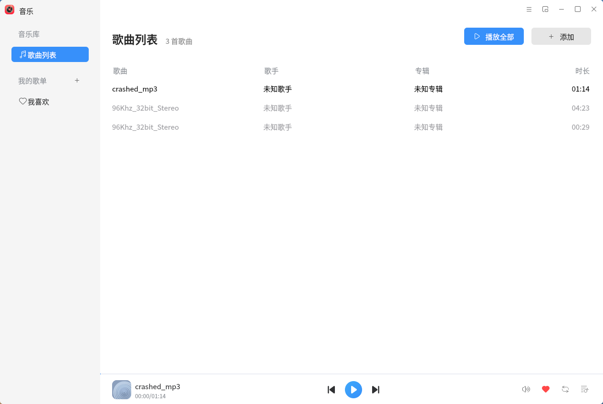
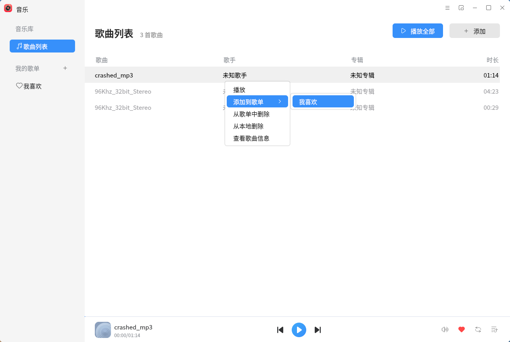

# Music Player

## Overview
 Music Player is a simple to use, user-friendly, support.mp3,.ogg,.wma,.spx,.flac and other music formats music player. While playing local music, you can also group music by custom playlists according to your preferences. In addition to the regular mode, Music Player also has a small window mode to meet the different needs of users.

### Songs List page

The song list page after adding the songs is shown in the Fig.below. You can select the control area for play/pause, previous track, next track and so on.

### Right click on the song

Select the right button to add to your favorite playlist, delete songs, view song information and other operations.

### Toggle mini mode

You can switch the Mini window for better user experience.

#### Before Toggle mini mode

#### After Toggle mini mode

