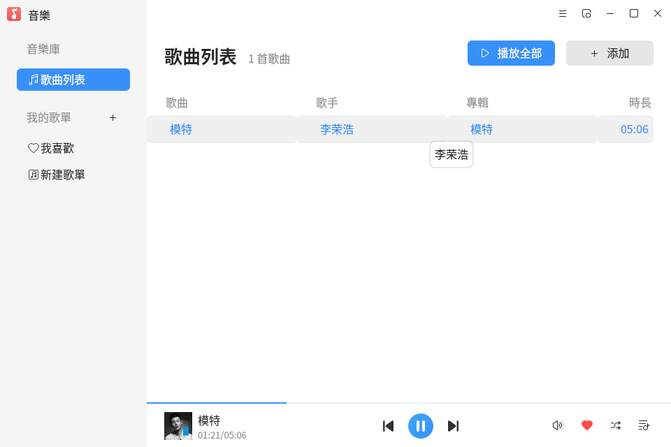
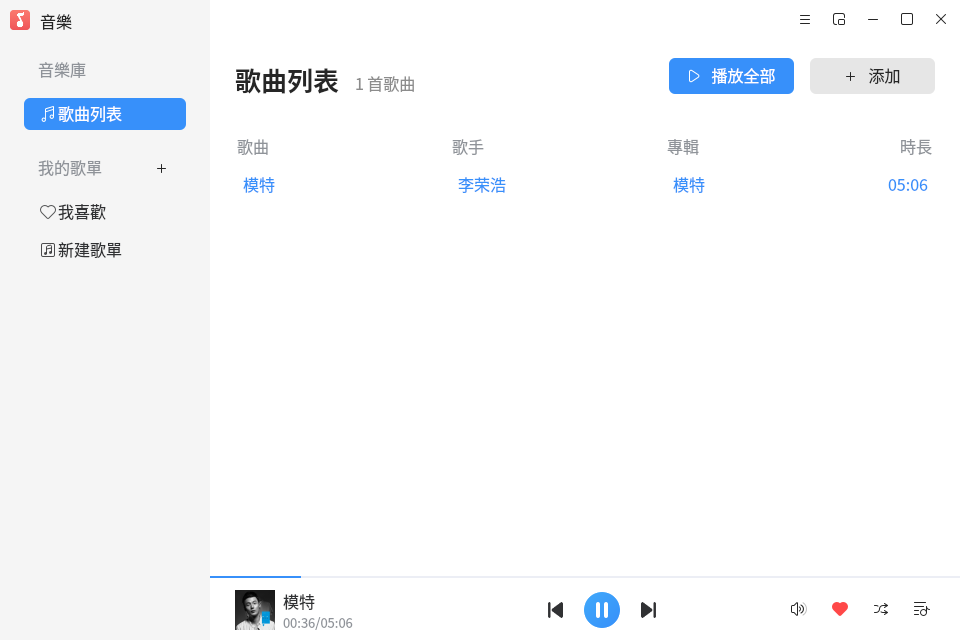
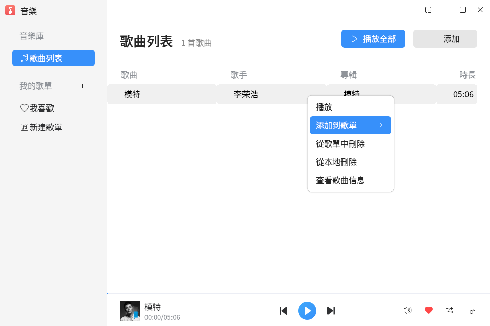

# 音樂
## 概述
音樂是一款簡單易用，界面友好，支持.mp3、.ogg、.wma、.spx、.flac等音樂格式的音樂播放器。在播放本地音樂的同時，還可以根據喜好將自定義歌單來對音樂進行分組。除了常規模式外，音樂還有小窗口模式來滿足用戶的不同需求。

 

## 歌曲列表頁面

 

添加完歌曲後的歌曲列表頁面如下圖所示。

 

 

### 功能介紹
您可以選擇控制區域進行播放/暫停、上一首、下一首等操作。

 

## 歌曲右鍵

 

您可以選擇一首歌曲進行添加到我喜歡，刪除，查看歌曲信息等操作。

 

### 功能介紹

 

選擇右鍵可以進行添加到自己喜歡的歌單、刪除歌曲、查看歌曲信息等操作。

 

 

## 切換迷你模式

爲了更好的體驗您可以切換mini窗口。

 

